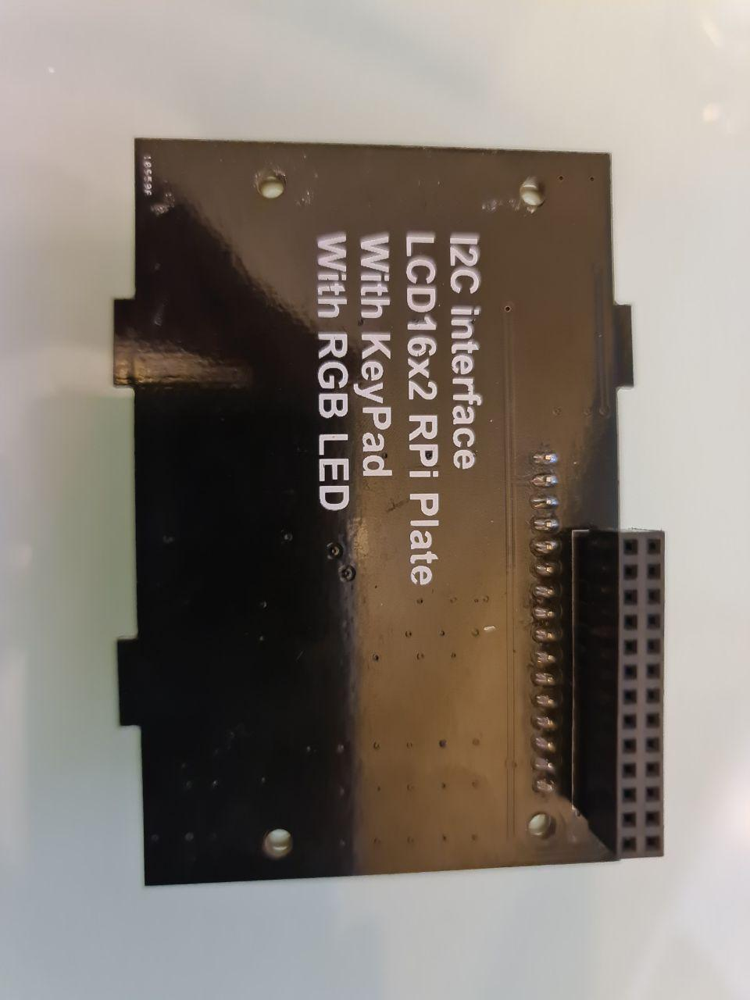
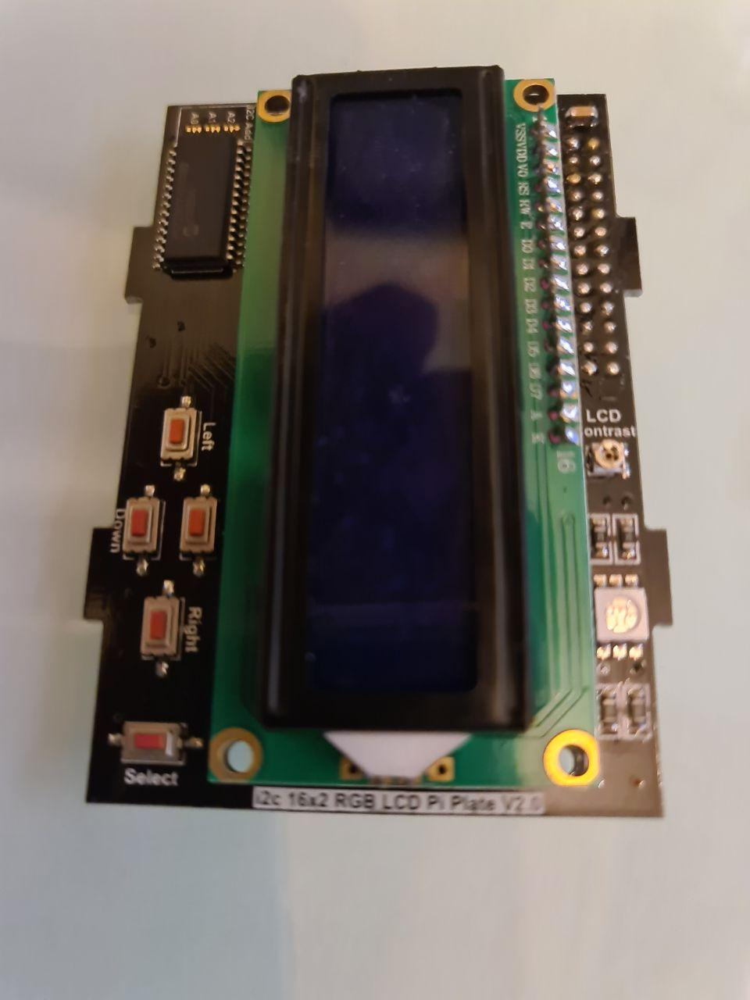

# i2c-http-server
Python HTTP server that connects with I2C LCD functions for Raspberry Pi. It exposes several options, such as:
* Displaying message, in 16x2 LED display
* Turning on and off the backlight
* Turning on RGB light, with 3 colors: Red, Green and Blue

## Important Notice

* Using I2C LCD Display Shield, complete with button and RGB light. The one I used like below picture (I download the documentation and library from ADRIVE website).

* Please ensure you check with the seller of I2C LCD shield, to ensure you have the correct library
* This is not low-level driver. This apps is using Python library provided the manufacturer of the I2C LCD. 
* Only tested in Raspberry Pi 1, and using Raspbian Stretch Lite

## Prerequisites

* Raspberry Pi 1 with Raspian Stretch Lite Installed. Don't forget to update to the latest
  * `sudo apt-get update`
  * `sudo apt-get upgrade`
* Install python-pip and python-smbus
  * `sudo apt-get install python-pip`
  * `sudo apt-get install python-smbus`
* Enable I2C interfaces, in your Raspberry Pi
  * `sudo raspi-config`

## Checking Library Compatibility with I2C LCD Device

This is very important step, to ensure your are using correct library/driver. The I2C LCD shields are created by several different manufacturers. Ensure you are using the correct library. In my case, the documentation and library are downloaded from ADRUVE website
* Documentation can be downloaded from [this github](res/16x2-character-lcd-plus-keypad.pdf) or from [adrive](https://www.adrive.com/public/zGq5hm/16x2-character-lcd-plus-keypad.pdf)
* Python library can be downloaded from [this github](res/Adafruit_CharLCDPlate.tar.gz) or from [adrive](https://www.adrive.com/public/xATcKC/Adafruit_CharLCDPlate.tar.gz)
* Run below command, to ensure your Raspberry Pi is connected to I2C LCD
  * `sudo i2cdetect -y 1`
  * From the downloaded and extracted library folder, run `sudo python LCDtest.py`

## Configuration

Not so much to configure here. This apps is using `9090` as HTTP port, to expose HTTP services. You can change the port in `i2c-runner.py` file

## Running

`sudo python i2c-runner`

## Using

There are several operations, exposed by HTTP server. All are using HTTP GET operations (just for simplification, not RESTful compliance)
* Change `{host}` to the IP of your Raspberry Pi
* Turning on the LCD backlight
  * `GET http://{host}/lcd/on`
* Turning off the LCD backlight
  * `GET http://{host}/lcd/off`  
* Set the RBG light to RED
  * `GET http://{host}/lcd/red`
* Set the RBG light to BLUE
  * `GET http://{host}/lcd/blue`
* Set the RBG light to GREEN
  * `GET http://{host}/lcd/green`
* Published message in LCD display
  * `GET http://{host}/{msg_in_row1}/{msg_in_row2}`
  * {msg_in_row1}: Message in the first row of LCD
  * {msg_in_row2}: Message in the second row of LCD
* Clean message, and turn off backlight and RGB light
  * `GET http://{host}/clean`

